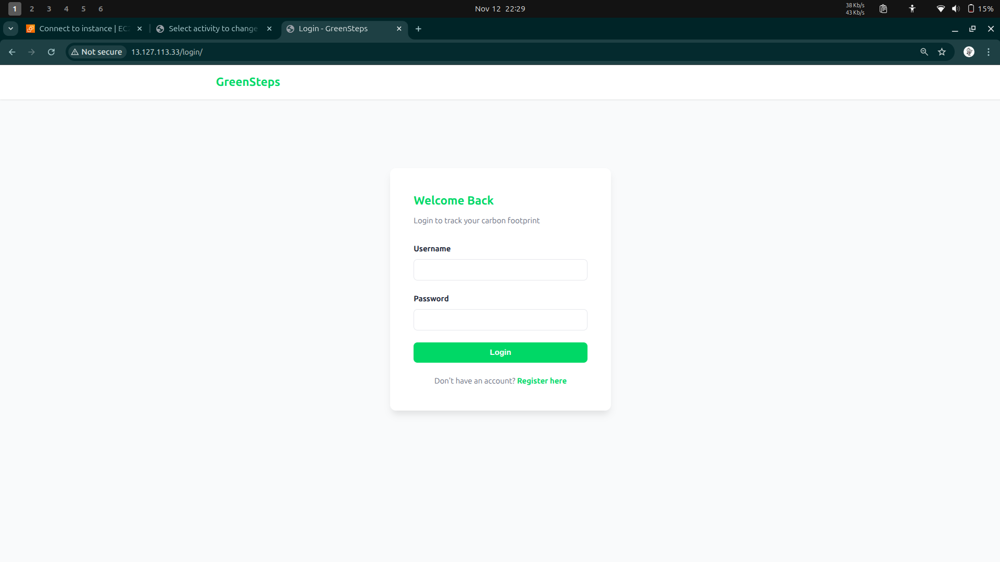
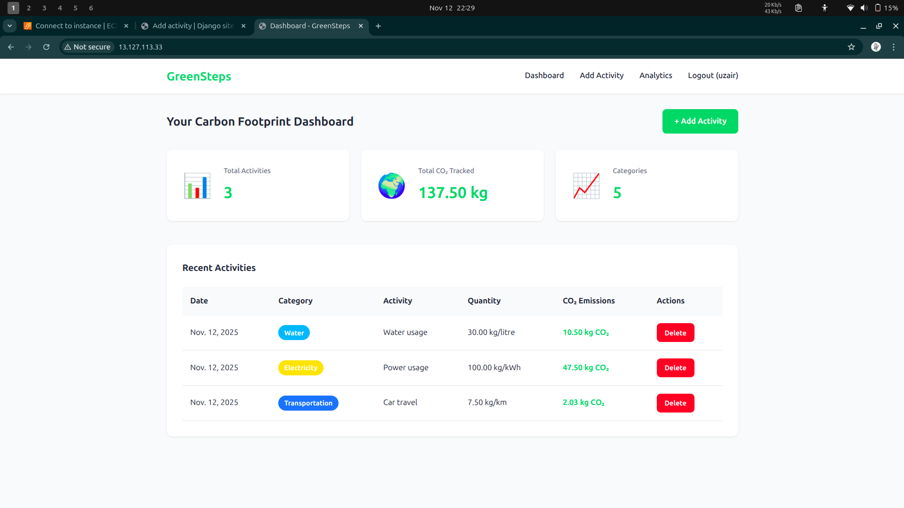
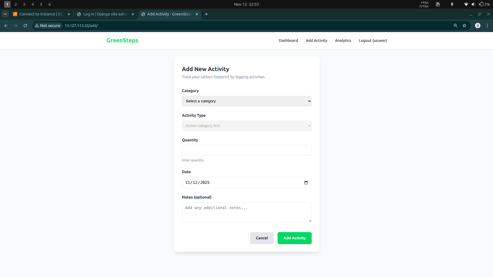
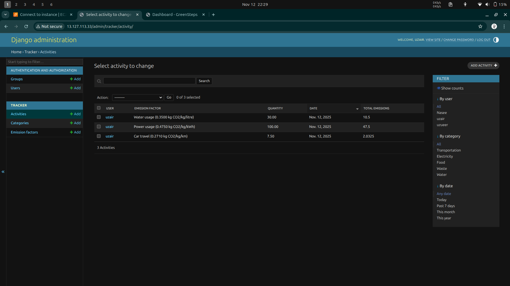
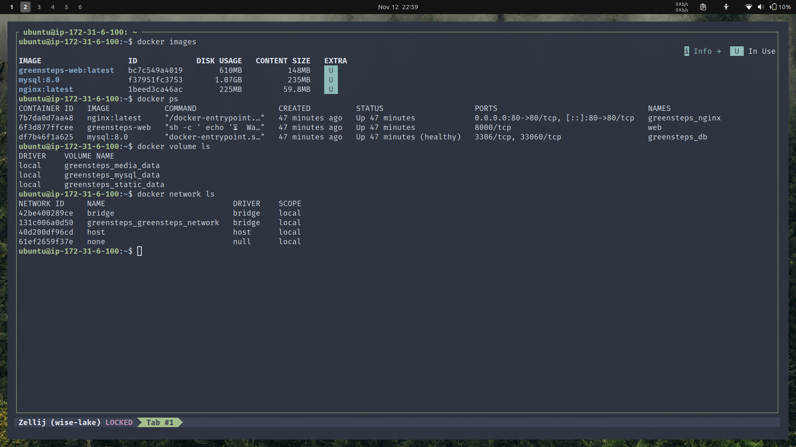
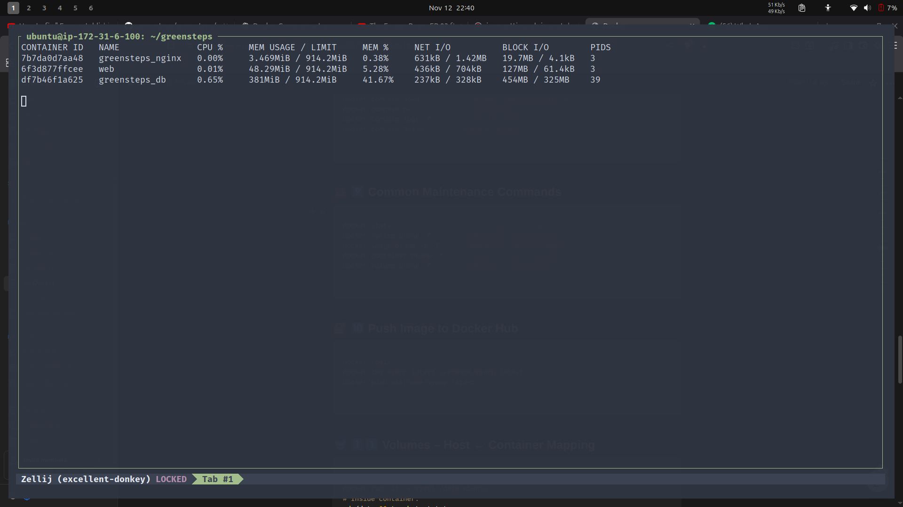
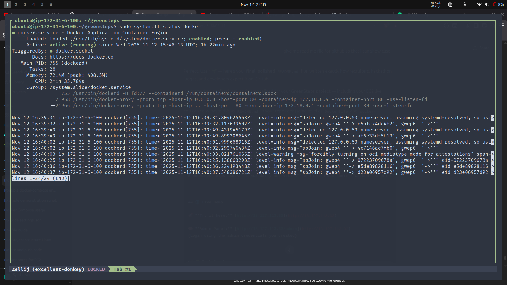

# 🌱 GreenSteps – Carbon Footprint Tracker

A full-stack sustainability tracker built with **Django**, **MySQL**, **Docker**, and **Nginx**, deployed on **AWS EC2**.
**GreenSteps** helps users **track daily activities** and calculate their **carbon footprint**, contributing to **UN SDG 13: Climate Action**.

---

## 🌍 Live Deployment

🚀 **Live Demo:** [http://13.127.113.33](http://13.127.113.33)
🔑 **Admin Panel:** [http://13.127.113.33/admin](http://13.127.113.33)

---

## 🧩 Tech Stack

| Layer | Technology |
|--------|-------------|
| **Frontend** | HTML, CSS, JAVASCRIPT|
| **Backend** | Django 5 (Python 3.11) |
| **Database** | MySQL 8 |
| **Server** | Gunicorn + Nginx |
| **Deployment** | Docker, Docker Compose, Docker Volume ,Docker Network , AWS EC2 (Ubuntu 24.04) |

---

## 🧱 Project Overview

GreenSteps empowers users to make climate-conscious choices by tracking CO₂ emissions from daily activities — such as transportation, food, and electricity use.

Users can:
✅ Log eco-related activities
✅ View their total CO₂ footprint
✅ Analyze emission patterns
✅ Manage categories and emission factors via Django Admin

---

## 🗂 Project Structure

```

greensteps/
├── greensteps/              # Django project settings
│   ├── settings.py
│   ├── urls.py
│   └── wsgi.py
├── tracker/                 # Core app for carbon tracking
│   ├── models.py
│   ├── views.py
│   ├── urls.py
│   ├── templates/
│   └── static/
├── nginx/
│   └── nginx.conf
├── Dockerfile
├── docker-compose.yaml
├── requirements.txt
├── .env.example
└── README.md

````

---

## ⚙️ Environment Variables

Create a `.env` file in your root directory using this template:

```bash
DJANGO_SECRET_KEY=your_secret_key_here
DJANGO_DEBUG=False
DJANGO_ALLOWED_HOSTS=*

DB_ENGINE=django.db.backends.mysql
DB_NAME=greensteps_db
DB_USER=greensteps_user
DB_PASSWORD=greensteps_pass
DB_HOST=db
DB_PORT=3306
````

> ⚠️ Keep `.env` out of version control. Use `.env.example` instead.

---

## 🐳 Deployment Guide (AWS EC2 + Docker)

### 1️⃣ Clone the Repository

```bash
git clone https://github.com/syeduzair/greensteps.git
cd greensteps
cp .env.example .env
```

### 2️⃣ Build and Run the Containers

```bash
docker compose up -d --build
```

### 3️⃣ Check Running Containers

```bash
docker ps
```

Make sure `greensteps_db` shows `(healthy)` and `greensteps_web` + `greensteps_nginx` are running.

---

### 4️⃣ Setup Django Inside Container

```bash
docker compose exec web python manage.py migrate
docker compose exec web python manage.py createsuperuser
docker compose exec web python manage.py collectstatic --noinput
docker compose restart nginx
```

---

## 🧮 Database Schema

| Table                    | Description                                |
| ------------------------ | ------------------------------------------ |
| `auth_user`              | Default Django user table                  |
| `tracker_category`       | Categories (e.g., Transport, Food, Energy) |
| `tracker_emissionfactor` | CO₂ emission factors for each activity     |
| `tracker_activity`       | User activity logs                         |

---

### Example Data (Insert via MySQL)

```sql
INSERT INTO tracker_category (name, icon, color) VALUES
('Transportation', '🚗', '#1E90FF'),
('Electricity', '⚡', '#FFD700'),
('Food', '🍔', '#FF6347'),
('Waste', '🗑️', '#32CD32'),
('Water', '💧', '#00BFFF');

INSERT INTO tracker_emissionfactor (category_id, activity_name, co2_per_unit, unit) VALUES
(1, 'Car travel', 0.271, 'kg/km'),
(1, 'Flight (short haul)', 0.255, 'kg/km'),
(2, 'Power usage', 0.475, 'kg/kWh'),
(3, 'Beef consumption', 27.0, 'kg/kg'),
(3, 'Chicken consumption', 6.9, 'kg/kg'),
(4, 'Plastic waste', 1.5, 'kg/kg'),
(5, 'Water usage', 0.35, 'kg/litre');
```

---

## 🧠 Features

✅ User registration & login
✅ Add and track activities with date and quantity
✅ Real-time CO₂ emission calculation
✅ Django Admin for managing emission factors
✅ Containerized setup (Django + MySQL + Nginx)
✅ Live on AWS EC2 using Docker Compose

---

## 🧰 Common Docker Commands

| Command                                                            | Description                              |
| ------------------------------------------------------------------ | ---------------------------------------- |
| `docker compose up -d --build`                                     | Build & start containers                 |
| `docker compose down -v`                                           | Stop & remove all containers and volumes |
| `docker compose logs -f`                                           | View real-time logs                      |
| `docker exec -it web bash`                                         | Access Django shell                      |
| `docker compose exec web python manage.py migrate`                 | Run migrations                           |
| `docker compose exec web python manage.py createsuperuser`         | Create admin                             |
| `docker compose exec web python manage.py collectstatic --noinput` | Collect static files                     |

---

## 🖼️ Screenshots

### 🌍 Login Page


### 📊 Dashboard


### ➕ Add New Activity


### 🧮 Admin Panel


---

### 🧰 Docker Setup (Server Deployment Proof)

#### 🧱 Docker Containers, Volumes & Network


#### ⚙️ Docker Resource Usage


#### 🟢 Docker Service Status



## 📊 Future Roadmap

* 🌍 Global leaderboard by CO₂ score
* 📈 Interactive analytics dashboard
* 🌤️ Integration with Climatiq API for real emission data
* 🧠 AI-based personalized eco-friendly recommendations
* 🔐 Google / Microsoft OAuth Login

---

## 👨‍💻 Author

**Syed Uzair**


---

## 💚 Acknowledgment

This project supports the **United Nations Sustainable Development Goal 13: Climate Action**.

> *“The first step to a sustainable future is knowing your impact — GreenSteps helps you take that step.”*

---

## ⭐ Support the Project

If you find this project interesting:

* 🌟 Star this repo
* 🍴 Fork it
* 💬 Share feedback
* 🚀 Try it live at [http://13.127.113.33](http://13.127.113.33)

---
